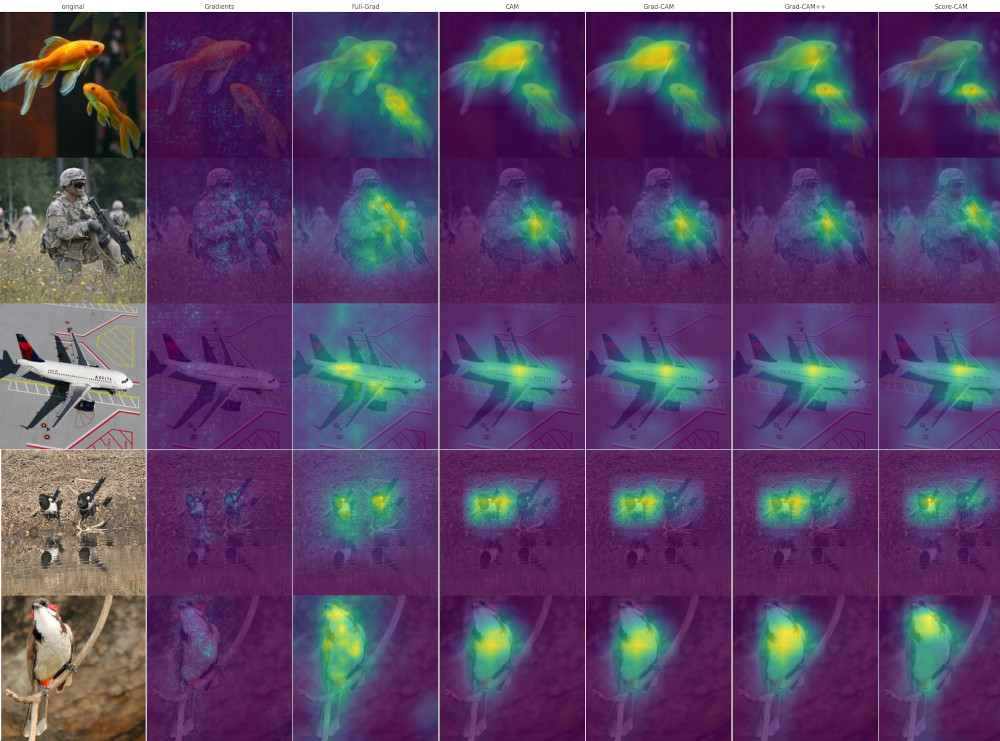

=================
keras Explainable
=================

Efficient explaining AI algorithms for Keras models.

Installation
------------

.. code-block:: shell

  pip install tensorflow
  pip install git+https://github.com/lucasdavid/keras-explainable.git

Usage
-----

This example illustrate how to explain predictions of a Convolutional Neural
Network (CNN) using Grad-CAM. This can be easily achieved with the following
example:

.. code-block:: python

  import keras_explainable as ke

  model = tf.keras.applications.ResNet50V2(...)
  model = ke.inspection.expose(model)

  scores, cams = ke.gradcam(model, x, y, batch_size=32)

Implemented Explaining Methods
------------------------------

Gradient-based Explaining Methods:

- Gradient Back-propagation
- FullGrad
- Smooth-Grad

CAM-Based Visualization Methods:

- CAM
- Grad-CAM
- Grad-CAM++
- Score-CAM
